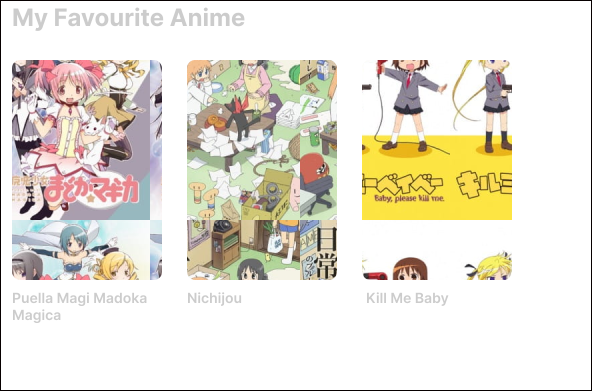

<h1 align="center">
  <br>
  <br>
  Hi Mom, I'm on Github 
	
	
  <br>
</h1>


<h3 align="center">Hello i'm Figo, I'm Madoka Magica SuperFan, Interested in Software Engineering and System Security.</h3>
<h3 align="center">Currently Studying/Using : </h3>

<div align="center">
	


	
	
</div>


<h3 align="center">Next Goal : </h3>

<div align="center">
	


	
	
</div>


  <div align ="center" width = "200" height="200">
    <a align="center" href="https://github.com/hansfigo/github-readme-stats">
      
    </a>
    <a href="https://github.com/hansfigo/github-readme-stats">
      
    </a>
  </div>


## Profile

* Curently Student of informatic System at Amikom Yogyakarta University
* Interested in Software Engineering, Fullstack Developer & Cyber Security
* Hobby :  Collecting Anime BD, Studying about Computer, Painting.


<div>
	<br>
	<a>
		
	</a>
	<br>
</div>


		
			

<!-- [](https://github.com/anuraghazra/github-readme-stats) -->

<!-- <p align="center">
  <a href="https://badge.fury.io/js/electron-markdownify">
    
  </a>
  <a href="https://gitter.im/amitmerchant1990/electron-markdownify"></a>
  <a href="https://saythanks.io/to/bullredeyes@gmail.com">
      
  </a>
  <a href="https://www.paypal.me/AmitMerchant">
    
  </a>
</p> -->


%
<!-- ## How To Use

To clone and run this application, you'll need [Git](https://git-scm.com) and [Node.js](https://nodejs.org/en/download/) (which comes with [npm](http://npmjs.com)) installed on your computer. From your command line:
a
```bash
# Clone this repository
$ git clone https://github.com/amitmerchant1990/electron-markdownify

# Go into the repository
$ cd electron-markdownify

# Install dependencies
$ npm install

# Run the app
$ npm start
```

> **Note**
> If you're using Linux Bash for Windows, [see this guide](https://www.howtogeek.com/261575/how-to-run-graphical-linux-desktop-applications-from-windows-10s-bash-shell/) or use `node` from the command prompt.


## Download

You can [download](https://github.com/amitmerchant1990/electron-markdownify/releases/tag/v1.2.0) the latest installable version of Markdownify for Windows, macOS and Linux.

## Emailware

Markdownify is an [emailware](https://en.wiktionary.org/wiki/emailware). Meaning, if you liked using this app or it has helped you in any way, I'd like you send me an email at <bullredeyes@gmail.com> about anything you'd want to say about this software. I'd really appreciate it!

## Credits

This software uses the following open source packages:

- [Electron](http://electron.atom.io/)
- [Node.js](https://nodejs.org/)
- [Marked - a markdown parser](https://github.com/chjj/marked)
- [showdown](http://showdownjs.github.io/showdown/)
- [CodeMirror](http://codemirror.net/)
- Emojis are taken from [here](https://github.com/arvida/emoji-cheat-sheet.com)
- [highlight.js](https://highlightjs.org/)

## Related

[markdownify-web](https://github.com/amitmerchant1990/markdownify-web) - Web version of Markdownify

## Support

<a href="https://www.buymeacoffee.com/5Zn8Xh3l9" target="_blank"></a>

<p>Or</p> 

<a href="https://www.patreon.com/amitmerchant">
	
</a>

## You may also like...

- [Pomolectron](https://github.com/amitmerchant1990/pomolectron) - A pomodoro app
- [Correo](https://github.com/amitmerchant1990/correo) - A menubar/taskbar Gmail App for Windows and macOS

## License

MIT

---

> [amitmerchant.com](https://www.amitmerchant.com) &nbsp;&middot;&nbsp;
> GitHub [@amitmerchant1990](https://github.com/amitmerchant1990) &nbsp;&middot;&nbsp;
> Twitter [@amit_merchant](https://twitter.com/amit_merchant)
 -->
